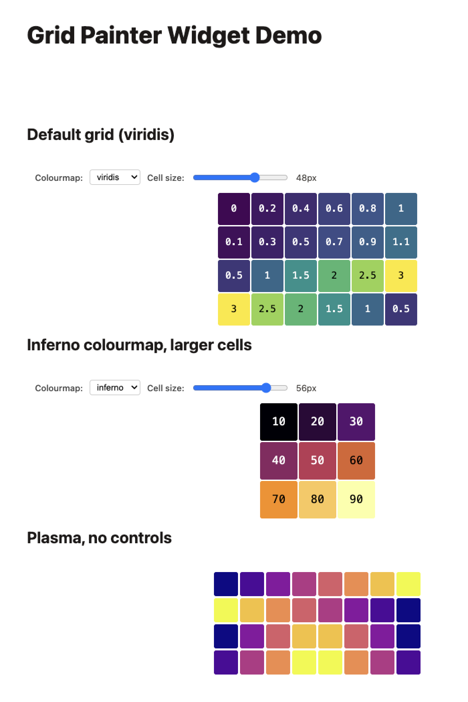

# grid-painter-widget

A minimal AnyWidget wrapping a standalone JavaScript visualization library, used
as the companion example for the tutorial blog post.

## Quick start

```sh
npm install
npm run build          # → dist/index.js

# Preview in Cuvenote
cd article && npx curvenote start
```

## Structure

```
src/
  grid-painter.js   ← standalone visualisation library (no widget knowledge)
  styles.css        ← widget styles (bundled as text)
  index.js          ← anywidget render() wrapper
dist/
  index.js          ← esbuild bundle (ESM)
article/
  widget.mjs        ← copy of the bundle for MyST
  index.md          ← MyST article using the widget
  myst.yml          ← MyST config
```

## Example Article with Widget

